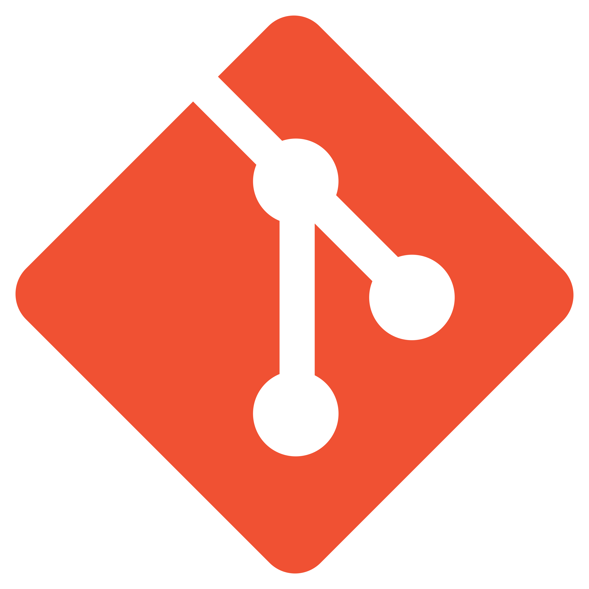

# Hello World!

- Me llamo **Diego** y soy un desarrollador web full stack
  

<p>Estas son las tecnologías y lenguages que he usado</p>





 
<br clear="left">

Para contactarme puedes enviarme un email a la dirección de abajo 👇

[Contact](mailto:diegonoviluce28@gmail.com)

 <!--START_SECTION:waka-->

```txt
TypeScript   9 hrs 16 mins         █████████████████████▒░░░   85.63 %
HTML         1 hr 3 mins           ██▒░░░░░░░░░░░░░░░░░░░░░░   09.78 %
SCSS         16 mins               ▓░░░░░░░░░░░░░░░░░░░░░░░░   02.58 %
JSON         12 mins               ▒░░░░░░░░░░░░░░░░░░░░░░░░   01.92 %
Other        0 secs                ░░░░░░░░░░░░░░░░░░░░░░░░░   00.09 %
```

<!--END_SECTION:waka-->
